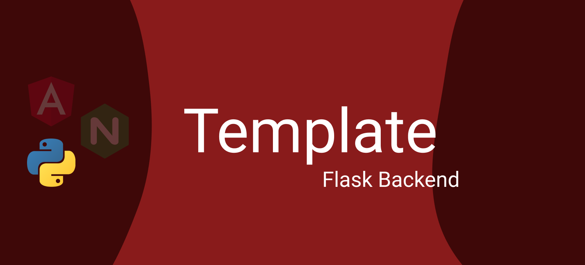

# Flask Backend

> Flask backend with the book API



## Important!!

As in debug mode and for testing purposes, the config JWT Token and Flask Secret are by default. **By any circumstances this config should go to production so change the passwords**

## Prerequisites

* [Python3](https://www.python.org/download/releases/3.0/)
* [Pip](https://pypi.org/project/pip/)
* [Virtualenv](https://virtualenv.pypa.io/en/latest/)
* [Redis](https://redis.io)
* [Mongo DB](https://www.mongodb.com)

It's important to download all those resources because the app heavily depends on them.


## Debug

1. Run ```bootstrap.sh``` and create say **yes** to create a virtual environment
2. A new server will be listening on 5000 port

## Deploy

Just use the Docker configuration of the root project.

## Configuration settings

### Virtual Environment
Python venv is used for developing purposes. Virtual environment is used in order to wrap all the dependencies inside the project and avoid collisions with the global configuration of Python. 

### Config settings
We use a ```config.py``` file to set up multiple config environments for our app.
This config is based from the Djang's config file. We have a base config class that the other class inherit form.

### Autoenv
[Autoenv](https://github.com/inishchith/autoenv) is a great tool for auto-activating virtualenvs and setting project-specific environment variables.
We use autoenv for entering the env every time we cd into our directory and setting the Development configuration.
Please use the tutorial for further information about the installation.


### .env File
The ```.env``` file stores all the environment variables needed to config the project. As we use autoenv, it searches for this file in order to get all the configuration we need.


## Background Tasks
To execute long running task, we use a task queue and a message broker to send the necesssary data to a process that will run thos background tasks. Celery needs a message broker to communicate the process with flask. Some of the best message brokers are Redis or RabbitMQ.


### Redis
As stated [here](http://www.python88.com/topic/1045) we could use several message brokers:

* RabbitMQ is recommended and very efficient (might be more than what you need) solution as message broker. It also supports reliable delivery using acknowledgement for messages But can give you a performance hit, If your application is task heavy and RabbitMQ is tuned for more reliability.

* Redis, on the other side is a easy to install & faster in processing but does Not guarantee the delivery, which is unlike RabbitMQ. Hence termination of server Or even Celery crash may result in loss of task information.

Redis has **disadvantages** , but it's easier to use, so for this lightweight template it fits better.

### Celery
Celery is a task queues manager. Taks queues are used as amechanism to distribute work across threads or machines. Celery communicates via messages, usually using a broker to mediate between clients and workers. To initiate a task the client adds a message to the queue, the broker then delivers that message to a worker.


## DDBB

### Mongo DB

We use Mongo DB as a document-based Data Base. The conection is made by the [pymongo](https://pymongo.readthedocs.io/en/stable/) library with the [Flask-PyMongo](https://flask-pymongo.readthedocs.io/en/latest/) wrapper to integrate the configuration with Flask.


## Testing

### Pytest
Library used for testing, just run ```pytest``` to check all the results

